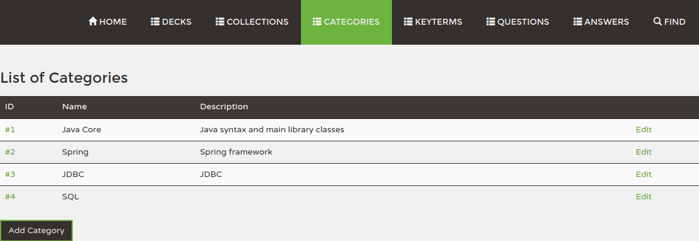

# KnowThenics

The application is under development.

### Table of Contents
* [General Info](#general-info)
* [Used Technologies](#used-Technologies)
* [How to Launch](#how-to-launch)
* [Project Status](#project-status)
* [Screenshots](#screenshots)
* [Database Schema](#database-schema)

[History of development](History.md)

### General Info

This project allows you to create Questions as well as add many unrelated Answers for each Question.
Questions and Answers are classified into Categories and contain Key Terms.
Questions can be combined into Collections.
Based on the collections, various users create Decks of FlashCards that can be used for Interval Training
(not implemented yet). 

### Used Technologies
* Back
    * Spring Boot
    * Spring Data JPA
    * Spring MVC
    * H2 database
    * MySQL
* Front
    * Thymeleaf, HTML, Bootstrap

### How to Launch
This section is not finished yet. These instructions are mostly for personal use.
There is no guarantee that they will produce expected result on any machine.
They need to be tested and clarified.
* Build: `mvn package`
* Create database: [create-db.sql](knowthenics-data/src/main/scripts/create_db.sql)
* Create schema: [knowthenics_db_schema.sql](knowthenics-data/src/main/scripts/knowthenics_db_schema.sql)
* Test connection: `jdbc:mysql://localhost:3306/knowthenics_prod?useSSL=false&serverTimezone=UTC`
* Run: `java -jar knowthenics-web-X.Y.Z-SNAPSHOT.jar --spring.active.profile=... --spring.datasource.password=...`

### Project Status

This section is empty yet.

Profiles
--------
(Revise this Section)

Use Profiles:
* default 
* dev
* prod

Screenshots
-----------
  

  

  

  

  

  

Database Schema
---------------

